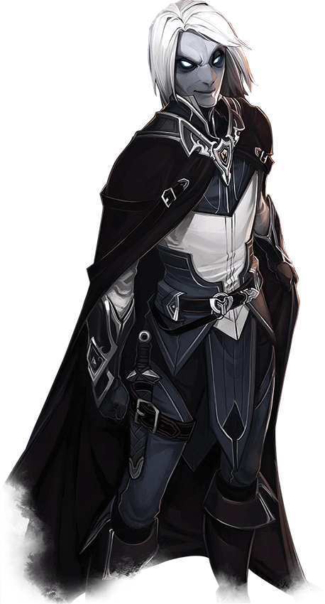

# Changelin

D'apparence toujours fluctuante, les changelins passent souvent inaperçus dans les sociétés qu'ils habitent. Chaque changelin peut adopter le visage qui lui convient grâce à son talent surnaturel. Pour certains, ces nouveaux traits ne sont qu'un déguisement. Pour d'autres, ils reflètent un aspect de leur âme.
Les premiers changelins du multivers apparurent en Féerie, la merveilleuse essence versatile de ce plan se retrouvant encore chez eux, même chez celles et ceux qui n'ont jamais foulé le royaume des fées. Chaque changelin décide comment utiliser son pouvoir de métamorphose, en canalisant la Féerie sous sa forme menaçante ou joyeuse.
Ils peuvent adopter un aspect par simple espièglerie ou malice, mais endossent parfois une nouvelle identité pour redresser des torts ou réjouir les opprimés.
Sous leur forme véritable, les changelins paraissent « effacés », comme si leur visage manquait de relief et de détails.
En croiser sous cette apparence reste rare, car la plupart changent de forme comme d'autres changent de tunique.
Les formes qu'ils adoptent sous l'impulsion du moment, sans grand contexte ni recherche, sont appelées « masques ».
Un masque sert à exprimer une humeur ou à remplir une fonction précise et ne sera parfois plus jamais réemployé.
Nombre de changelins développent toutefois des identités plus intimes, avec leur propre personnalité, leur vécu et leurs croyances. Un aventurier changelin pourra disposer d'identités pour plusieurs contextes, comme la négociation, l'investigation et le combat.
Une même identité pourra être partagée par plusieurs changelins; une communauté peut ainsi accueillir trois guérisseurs changelins, le rôle d'Andrea l'aimable médecin étant tour à tour endossé par celui ou celle qui est de service. Les identités se transmettent aussi au sein d'une même famille, les jeunes changelins tirant alors avantage des relations entretenues par leurs prédécesseurs.

# Traits

Changelin, vous présentez les traits raciaux suivants.

- **Type de créature.** Vous êtes une Fée.
  Catégorie de taille. Vous êtes de taille M ou P. Choisissez votre catégorie de taille au moment de choisir cette race.
- **Vitesse.** Votre vitesse de base au sol est de 9 m.
- **Instinct changelin.** Votre lien avec le royaume des fées vous confère la maîtrise de deux des compétences suivantes, à votre convenance : Intimidation, Intuition, Persuasion, Représentation ou Tromperie.
- **Métamorphe.** Au prix d'une action, vous pouvez modifier votre aspect et votre voix. Déterminez les détails de ces changements, notamment votre teint, la longueur de vos cheveux et votre sexe. Vous pouvez également ajuster votre taille et votre poids, et changer de catégorie de taille entre M et P.
  Vous pouvez vous faire passer pour un membre d'une autre race, mais cela n'influe pas sur votre profil de jeu.
  Vous ne pouvez pas reproduire l'aspect d'une personne que vous n'avez jamais vue et l'anatomie adoptée doit grossièrement correspondre à la vôtre, notamment la répartition des membres. Vos vêtements et votre équipement ne sont pas modifiés par ce trait.
  Vous conservez eette nouvelle forme jusqu'à ce que vous repreniez votre forme véritable au prix d'une action ou que vous mourriez.

