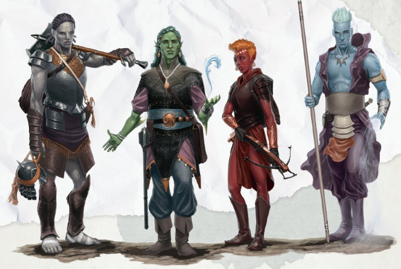

# Genasi

Les genasis, dont l'ascendance remonte aux génies des Plans Élémentaires, puisent dans la puissance des élé-ments. Air, Eau, Feu et Terre; tels sont les quatre piliers du Plan Matériel et les quatre types de genasi. Certains genasis descendent directement d'un génie, tandis que d'autres sont issus de parents non genasis qui vivaient à proximité d'un site imbibé de la magie d'un génie.
Le genasi moyen jouit d'une espérance de vie de 120 ans.

## Traits des Genasis d'Air

Les genasis d'air descendent des djinns, génies du Plan Elémentaire de l'Air. Ces êtres qui incarnent l'aspect aérien de leurs ancêtres d'outre-monde puisent dans leur lien avec les vents.
Le teint de peau des genasis d'air comprend nombre de nuances de bleu, ainsi que toutes celles des humains, avec un éclat bleuté ou cendré. Leur peau est parfois striée de lignes évoquant des fuites d'énergie azurée. La chevelure d'un genasi d'air flotte comme sous l'effet du vent, quand elle n'est pas entièrement composée de nuages de vapeur.

Genasi d'air, vous présentez les traits raciaux suivants.

- **Type de créature.** Vous êtes un Humanoïde.
- **Catégorie de taille.** Vous êtes de taille M ou P. Choisissez votre catégorie de taille au moment de choisir cette race.
- **Vitesse.** Votre vitesse de base au sol est de 10,50 m.
- **Danse avec les vents.** Vous connaissez le sort mineur poigne électrique. À partir du niveau 3, vous pouvez lancer le sort feuille morte par ce trait, sans composante matérielle.
  À partir du niveau 5, vous pouvez également lancer le sort lévitation sur vous-même par ce trait, sans composante matérielle. Une fois feuille morte ou lévitation lancé par ce biais, vous devez terminer un repos long pour pouvoir relancer ainsi le sort en question. Vous pouvez également lancer ces deux sorts avec vos éventuels emplacements de sort de niveau adéquat.
  L'Intelligence, la Sagesse ou le Charisme est votre caractéristique d'incantation pour lancer ces sorts (décidez laquelle au moment de choisir cette race).
- **Résistance à la foudre.** Vous bénéficiez de la résistance aux dégâts de foudre.
- **Souffle intérieur.** Tant que vous n'êtes pas neutralisé, vous pouvez retenir votre souffle indéfiniment.
- **Vision dans le noir.** Dans un rayon de 18 m, vous voyez en conditions de lumière faible comme si la lumière était vive, et dans les ténèbres comme sous une lumière faible.
  Dans les ténèbres, vous discernez les couleurs comme des nuances de gris.

## Traits des Genasis d'Eau

Les genasis d'eau descendent des marides, génies aquatiques du Plan Élémentaire de l'Eau. Parfaitement adaptés à la vie subaquatique, ils portent en eux toute la puissance des vagues.
Leur peau présente des nuances de bleu ou de vert. parfois un mélange des deux. Quand leur peau est d'aspect plus humain, elle montre une texture luisante comme des gouttelettes d'eau ou d'imperceptibles écailles de poisson.
Leur chevelure rappelle parfois des algues flottant sous l'effet du courant, ou ressemble plus directement à l'onde marine.

Genasi d'eau, vous présentez les traits raciaux suivants.

- **Type de créature.** Vous êtes un Humanoïde.
- **Catégorie de taille.** Vous êtes de taille M ou P.
  Choisissez votre catégorie de taille au moment de choisir cette race.
- **Vitesse.** Votre vitesse de base au sol est de 9 m et vous êtes doté d'une vitesse de nage égale à votre vitesse au sol.
- **Amphibie.** Vous pouvez respirer sous l'eau comme à l'air libre.
- **Appel de la vague.** Vous connaissez le sort mineur aspersion acide. Dès le niveau 3, vous pouvez lancer le sort création ou destruction d'eau par ce trait. À partir du niveau 5, vous pouvez lancer le sort marche sur l'onde par ce trait, sans composante matérielle. Une fois création ou destruction d'eau ou marche sur l'onde lancé par ce biais, vous devez terminer un repos long pour pouvoir relancer ainsi le sort en question. Vous pouvez également lancer ces deux sorts avec vos éventuels emplacements de sort de niveau adéquat.
  L'Intelligence, la Sagesse ou le Charisme est votre caractéristique d'incantation pour lancer ces sorts (déci-dez laquelle au moment de choisir cette race).
- **Résistance à l'acide.** Vous bénéficiez de la résistance aux dégâts d'acide.
- **Vision dans le noir.** Dans un rayon de 18 m, vous voyez en conditions de lumière faible comme si la lumière était vive, et dans les ténèbres comme sous une lumière faible.
  Dans les ténèbres, vous discernez les couleurs comme des nuances de gris.

## Traits des Genasis de Feu

Descendants des éfrits, génies du Plan Élémentaire du Feu, les genasis de feu embrassent la nature flamboyante et souvent destructrice de cet élément. Leur héritage se retrouve dans le ton de leur peau, qui peut aller du gris anthracite aux diverses nuances de rouge et d'orange. Certains présentent une peau plus humaine avec des marques ignées, comme des lueurs animées rappelant des braises ou des lignes rougeoyantes sur tout le corps. Leur chevelure ressemble à des mèches enflammées ou enduites de suie.

Genasi de feu, vous présentez les traits raciaux suivants.

- **Type de créature.** Vous êtes un Humanoide.
- **Catégorie de taille.** Vous êtes de taille M ou P. Choisissez votre catégorie de taille au moment de choisir cette race.
- **Vitesse.** Votre vitesse de base au sol est de 9 m.
- **Flambée innée.** Vous connaissez le sort mineur flammes.
  Dès le niveau 3, vous pouvez lancer le sort mains brûlantes par ce trait. À partir du niveau 5, vous pouvez lancer le sort lame de feu sur vous-même par ce trait, sans composante matérielle. Une fois mains brûlantes ou lame de feu lancé par ce biais, vous devez terminer un repos long pour pouvoir relancer ainsi le sort en question. Vous pouvez également lancer ces deux sorts avec vos éventuels emplacements de sort de niveau adéquat.
  L'Intelligence, la Sagesse ou le Charisme est votre caractéristique d'incantation pour lancer ces sorts (décidez laquelle au moment de choisir cette race).
- **Résistance au feu.** Vous bénéficiez de la résistance aux dégâts de feu.
- **Vision dans le noir.** Dans un rayon de 18 m, vous voyez en conditions de lumière faible comme si la lumière était vive, et dans les ténèbres comme sous une lumière faible.
  Dans les ténèbres, vous discernez les couleurs comme des nuances de gris.

## Traits des Genasis de Terre

Descendants des daos, génies du Plan Élémentaire de la Terre, les genasis de terre ont hérité de leur robustesse et de leur emprise sur cet élément.
La peau d'un genasi de terre a parfois la couleur de la terre ou de la pierre; quand son ton est plus humain, elle scintille comme saupoudrée de poussière de gemme. Chez certains, des lignes apparaissent comme des fissures qui rappellent des filons de pierre précieuse ou luisent d'un pâle éclat jaunâtre. La chevelure des genasis de terre semble parfois sculptée dans la pierre ou le cristal, ou évoque des brins de métal filé.

Genasi de terre, vous présentez les traits raciaux suivants.

- **Type de créature.** Vous êtes un Humanoïde.
  Catégorie de taille. Vous êtes de taille M ou P.
  Choisissez votre catégorie de taille au moment de choisir
  cette race.
- **Vitesse.** Votre vitesse de base au sol est de 9 m.
- **Foulée tellurienne.** Vous pouvez vous déplacer en terrain difficile sans dépenser de déplacement supplémentaire, dès lors que vous recourez à votre vitesse au sol.
- **Fusion avec la pierre.** Vous connaissez le sort mineur protection contre les armes. Vous pouvez le lancer nor-malement, ou alors le jeter par une action bonus autant de fois que votre bonus de maîtrise et vous récupérez ce quota en terminant un repos long.
  A partir du niveau 5, vous pouvez lancer le sort passage sans trace par ce trait, sans composante matérielle. Une fois ce sort lancé par ce biais, vous devez terminer un repos long pour pouvoir le relancer ainsi. Vous pouvez également lancer ce même sort avec vos éventuels emplacements de sort du 2' niveau ou plus.
  L'Intelligence, la Sagesse ou le Charisme est votre caractéristique d'incantation pour lancer ces sorts (décidez laquelle au moment de choisir cette race).
- **Vision dans le noir.** Dans un rayon de 18 m, vous voyez en conditions de lumière faible comme si la lumière était vive, et dans les ténèbres comme sous une lumière faible.
  Dans les ténebres, vous discernez les couleurs comme des
  nuances de gris.

