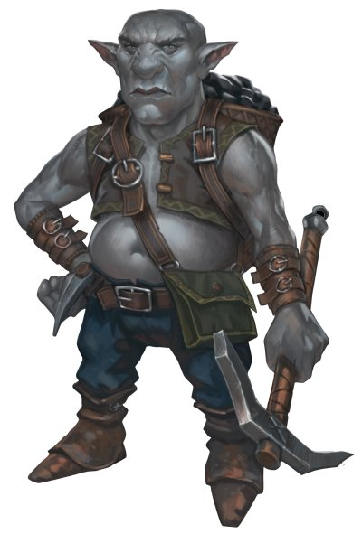

# Gnome des profondeurs

Les gnomes des profondeurs ou svirfneblins, originaires d'Outreterre, sont empreints de la magie de ce royaume sou-terrain. Leur talent surnaturel leur permet de se camoufler et leur magie svirfnebline les rend presque indétectables.
Ces facultés leur ont permis de survivre aux périls de l'Outre-terre pendant des générations.
Comme tous les gnomes, ceux des profondeurs vivent plusieurs siècles, parfois jusqu'à 500 ans.

## Traits

Gnome des profondeurs, vous présentez les traits raciaux suivants.

- **Type de créature.** Vous êtes un Humanoïde. Vous êtes considéré comme un gnome lorsqu'un prérequis ou un effet vous demande de l'être.
- **Catégorie de taille.** Vous êtes de taille P.
- **Vitesse.** Votre vitesse de base au sol est de 9 m.
- **Camouflage svirfneblin.** Lorsque vous effectuez un test de Dextérité (Discrétion), vous pouvez le faire avec avantage. Vous pouvez recourir à ce trait autant de fois que votre bonus de maîtrise et vous récupérez ce quota en terminant un repos long.
- **Faveur svirfnebline.** Dès le niveau 3, vous pouvez lancer le sort déguisement par ce trait. À partir du niveau 5, vous pouvez également lancer le sort antidétection par ce trait, sans composante matérielle. Une fois l'un de ces sorts lancé par ce biais, vous devez terminer un repos long pour pouvoir le relancer ainsi. Vous pouvez également lancer ces sorts avec vos éventuels emplacements de sort de niveau adéquat.
  L'Intelligence, la Sagesse ou le Charisme est votre caractéristique d'incantation pour lancer ces sorts (déci-dez laquelle au moment de choisir cette race).
- **Résistance gnome à la magie.** Vous êtes avantagé aux jets de sauvegarde d'Intelligence, Sagesse et Charisme contre les sorts.
- **Vision dans le noir.** Dans un rayon de 36 m, vous voyez en conditions de lumière faible comme si la lumière était vive, et dans les ténèbres comme sous une lumière faible.
  Dans les ténèbres, vous discernez les couleurs comme des nuances de gris.

