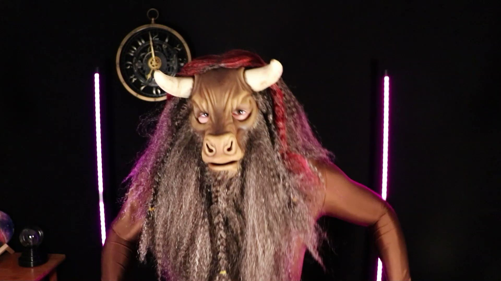

# Minotaure

Les minotaures sont des humanoides au torse puissant, dotés d'une tête de taureau.
Grâce à leur sens surnaturel de l'orientation, ils font de grands navigateurs. Certains sages estiment que les minotaures furent au départ créés par la Dame des Douleurs, pour patrouiller parmi les dédales magiques dans lesquels elle piège ses adversaires.
Les cornes des minotaures vont de 30 cm de long à près d'un mètre pour certains individus. Les minotaures les sculptent souvent pour en affûter les tranchants, graver des symboles de pouvoir ou les renforcer de bronze afin d'éviter qu'elles rompent au combat.
Une épaisse crinière court sur leur cou et leur dos puis-sants, certains minotaures présentant de longues touffes au niveau du menton et des bajoues. Leurs jambes sont dotées de lourds sabots fendus et leur longue queue se termine par une houppe.

# Traits

Minotaure, vous présentez les traits raciaux suivants.

- **Type de créature.** Vous êtes un Humanoïde.
- **Catégorie de taille.** Vous êtes de taille M.
- **Vitesse.** Votre vitesse de base au sol est de 9 m.
- **Boutoir.** Aussitôt après avoir touché une créature avec une attaque de corps à corps à votre tour, dans le cadre de l'action Attaquer, vous pouvez tenter de pousser cette cible avec vos cornes par une action bonus. La cible doit se trouver à 1,50 m ou moins de vous et sa catégorie de taille ne doit pas dépasser la vôtre de plus d'un cran.
  Si la cible ne réussit pas un jet de sauvegarde de Force dont le DD est égal à 8 + votre bonus de maîtrise + votre modificateur de Force, vous l'éloignez de vous d'un maximum de 3 m.
- **Cornes.** Vos cornes vous permettent d'effectuer des attaques à mains nues. Si vous touchez avec une telle attaque, vous infligez des dégâts perforants égaux à 1d6 + votre modificateur de Force, au lieu des dégâts contondants normalement associés aux attaques à mains nues.
- **Encornade.** Aussitôt après avoir entrepris l'action
  Foncer à votre tour et vous être déplacé d'au moins 6 m. vous pouvez effectuer une attaque de corps à corps avec vos Cornes par une action bonus.
- **Mémoire des labyrinthes.** Vous savez toujours où se trouve le nord et êtes avantagé à tout test de Sagesse (Survie) visant à vous orienter ou à suivre des traces.

